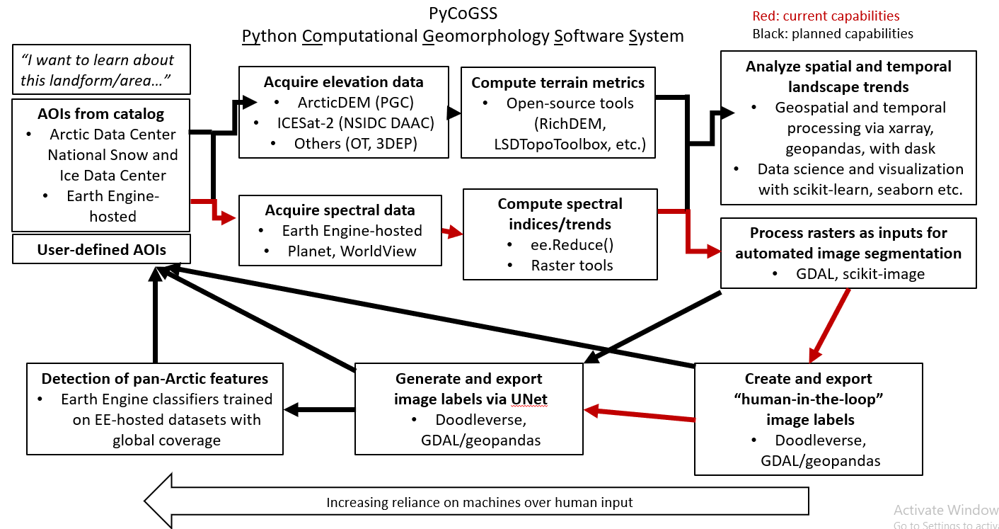
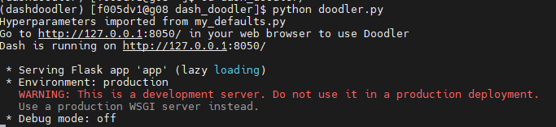

So begins the **Py**thon **Co**mputational **G**eomorphology **S**oftware **S**ystem!

# Steps
1. Use the GEE Code Editor and `gee_scripts` to grab ya imagery
2. Use `make_jpges.py` to turn ya Earth Engine files into jpgs for Doodler. 
3. Use [Dash Doodler](https://github.com/Doodleverse/dash_doodler) to label/segment ya imagery
4. Use [Segmentation Gym](https://github.com/Doodleverse/segmentation_gym) to segment unlabeled imagery 

# Plan

*Perhaps the only time in history someone is putting a figure from an in-prep NSF proposal so as to say "Please, if you can do this instead of me, go ahead"*

# Guides
## General Python guides
I have been compiling a guide to [Python-based landscape analysis](https://joanmarie.notion.site/Python-based-Landscape-Analysis-1e4b0f77794b4110925178117c2d9532) on my Notion site, but with the advent of PyCoGSS, I anticipate moving the guide to this repo. 

## Doodleverse guides for Dartmouth/HPC
This is a guide for accessing Doodleverse software in Dartmouth's HPC environment. Please consult the wikis of the Doodleverse software for help there.

### Doodler 
You have to [make an ssh tunnel](https://services.dartmouth.edu/TDClient/1806/Portal/KB/ArticleDet?ID=124517) to copy and paste the address that Doodler spits out:

1. ssh to andes or polaris
2. Do the instructions on the Github to install dash doolder. When installing Dash Doodler navigate to the `dash_doodler` directory with `cd dash_doodler`. Don’t worry about conda version errors. It will take a while.
3. activate your `dashdoodler` environment you created when installing Doodler
4. Run `python doodler.py` after navigating to the directory with `cd dash_doodler`
5. You have to make an ssh tunnel to copy and paste the address that Doodler spits out. Note the address: it should be `http://127.0.0.1:8050/`  The server is 127.0.0.1 and the port is 8050. 



6. Open another Terminal. Do `ssh` like you normally would but add flags `-NfL` (note capitals). The general syntax for ssh tunneling is:

`ssh -NfL [port]:[server]:[port] [your net id]@[linux machine address]`

so replicate the following but with your username


7. Copy and paste or type the http address into your web browser of choice. It should pop us as Doodler!!

### Segmentation Gym 

1. Use the `utils/gen_images_and_labels.py` script in Doodler (in your Doodler environment!) to generate the labels and images folders that you can point segmentation gym to. It helps if you put all your results that you want to use in one directory. A dumb thing is that you have to click into the directory when the prompt comes up (rather than selecting the folder). 
2. Log into Discovery

```jsx
ssh [id]@discovery7.dartmouth.edu
```

3. Start an [interactive session](https://services.dartmouth.edu/TDClient/1806/Portal/KB/ArticleDet?ID=132460) on Discovery. when you type `k80:4`  that means you are using 4 GPUs at once 😎 you do training in super-speed!! But if you aren’t doing any operations it could time out because those resources are sometimes high in demand. 

```jsx
srun -p gpuq --gres=gpu:k80:4 --pty /bin/bash
```

4. Making sure you installed Segmentation Gym according to the GitHub, activate your `gym` environment

```jsx
conda activate gym
```

5. Follow the [Segmentation Gym wiki](https://github.com/Doodleverse/segmentation_gym/wiki) and have fun!