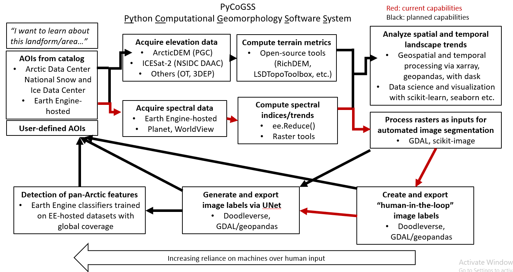

So begins the **Py**thon **Co**mputational **G**eomorphology **S**oftware **S**ystem!

Steps:
1. Use the GEE Code Editor and `gee_scripts` to grab ya imagery
2. Use `make_jpges.py` to turn ya Earth Engine files into jpgs for Doodler. 
3. Use Dash Doodler to label/segment ya imagery
4. Use Segmentation Gym to segment unlabeled imagery 

Plan:

